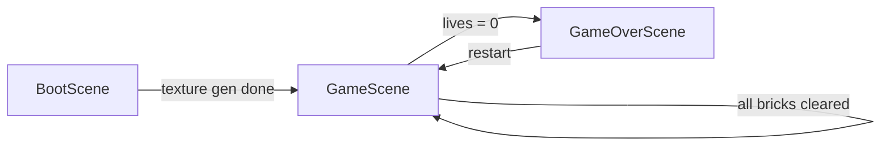

# Tech Stack

## Core

| Tech | Version | Purpose |
|------|---------|---------|
| Phaser | 4.0.0 (Caladan) | Game engine |
| Arcade Physics | bundled | Ball/brick/paddle collision |
| Vanilla JS | ES6+ | Game code |
| HTML5 Canvas / WebGL | - | Rendering (Phaser.AUTO) |

## Why Phaser 4?

- Lightweight 2D game framework
- Built-in Arcade Physics (perfect for Breakout)
- No build tools needed
- Canvas + WebGL auto-selection
- Mature input system (mouse, keyboard, touch)

## Why Arcade Physics?

Breakout needs simple AABB collision with bouncing:
- Ball ↔ Paddle: redirect ball based on hit position
- Ball ↔ Bricks: destroy brick, bounce ball
- Ball ↔ Walls: reflect off top and sides
- No need for Matter.js complexity

## Why No Build Tools?

- Small game, single-page
- Phaser loaded from local dist file (`../phaser/dist/`)
- ES6+ supported by all modern browsers
- Zero config, instant development

## Project Structure

```
project/
├── index.html              # Entry point, loads scripts
└── js/
    ├── config.js           # Phaser.Game config + boot
    └── scenes/
        ├── BootScene.js    # Texture generation
        ├── GameScene.js    # Main gameplay
        └── GameOverScene.js # Restart screen
```

## Scene Architecture



- **BootScene** — runs once, generates all textures from code
- **GameScene** — main loop, restarts for new levels (calls `this.scene.restart()`)
- **GameOverScene** — final score display, restarts into GameScene

## State Management

- `this.registry` — cross-scene data (final score)
- `init()` — per-start resets (score, lives, level)
- Scene `data` — not used currently

## Skills

17 Phaser 4 API reference skills are in `.agent/skills/`:
- game-setup-and-config, scenes, physics-arcade
- input-keyboard-mouse-touch, graphics-and-shapes
- groups-and-containers, text-and-bitmaptext
- animations, tweens, events-system, particles
- time-and-timers, v4-new-features, audio-and-sound
- loading-assets, scale-and-responsive
